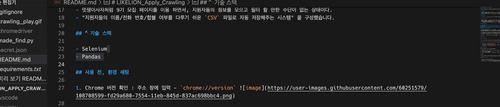

# LIKELION_Apply_Crawling

🦁 9th LikeLion at SCH apply page Selenium crawling

## 제작자

- 순천향대학교 16학번 컴퓨터소프트웨어공학과 [최민석](https://github.com/minsgy) - CSV[엑셀파일] 자동 생성 로직
- 순천향대학교 18학번 컴퓨터공학과 [최세환](https://github.com/Mactto) - 데이터 분석
- 한국기술교육대학교 17학번 컴퓨터공학부 [임우열](https://github.com/Woo-Yeol) - HWP[한글파일] 자동 생성 로직

## DEMO GIF

## 👨🏻‍💻 개요

- 멋쟁이사자처럼 지원자 정보 자동 추합 크롤링(Crawling) 프로그램
- 멋쟁이사자처럼 9기 모집 페이지를 이용 하면서, 지원자들의 정보를 모으고 필터 할 만한 수단이 없는 상태이다.
- "지원자들의 이름/전화 번호/합불 여부를 다루기 쉬운 `CSV` 파일로 자동 저장해주는 시스템" 을 구성했습니다.

## 🔨기술 스택

- Selenium
- Pandas

## 사용 전, 환경 세팅

1. Chrome 버전 확인 : 주소 창에 입력 - `chrome://version` 

2. Chrome 버젼과 Chrome 드라이버 버전 맞추기.[ChromeDriver 다운 링크](https://chromedriver.chromium.org/downloads) 

3. 다운받은 `ChromeDriver` 파일을 클론받은 `Root` 폴더에 저장.

## 사용법

### 1. 깃 클론

`git clone https://github.com/minsgy/LIKELION_Apply_Crawling.git`

### 2. 가상 환경 생성 및 실행 후, 종속성 다운로드

- `python -m venv <가상환경 이름>`
- `. <가상환경 이름>/script/activate`, mac:`. <가상환경 이름>/bin/activate`
- `pip install -r requirements.txt`

### 3.기본 세팅

학교 별 아이디. 비밀번호 설정 필요

1. 루트 디렉토리에 `secret.json` 파일 생성
2. `json` 형태로 작성함.
3. 지원서 운영진 아이디 : `APPLY_ID`, 지원서 운영진 비밀번호 : `APPLY_PW` 작성

※ 예시

### 4. 실행 과정

- `python made_find.py` 실행
- 크롬이 켜지면서, 크롤링 과정을 거치고 Chrome 종료.
- `UserList.csv` 파일 생성 (이름/전화번호/합불 여부)
